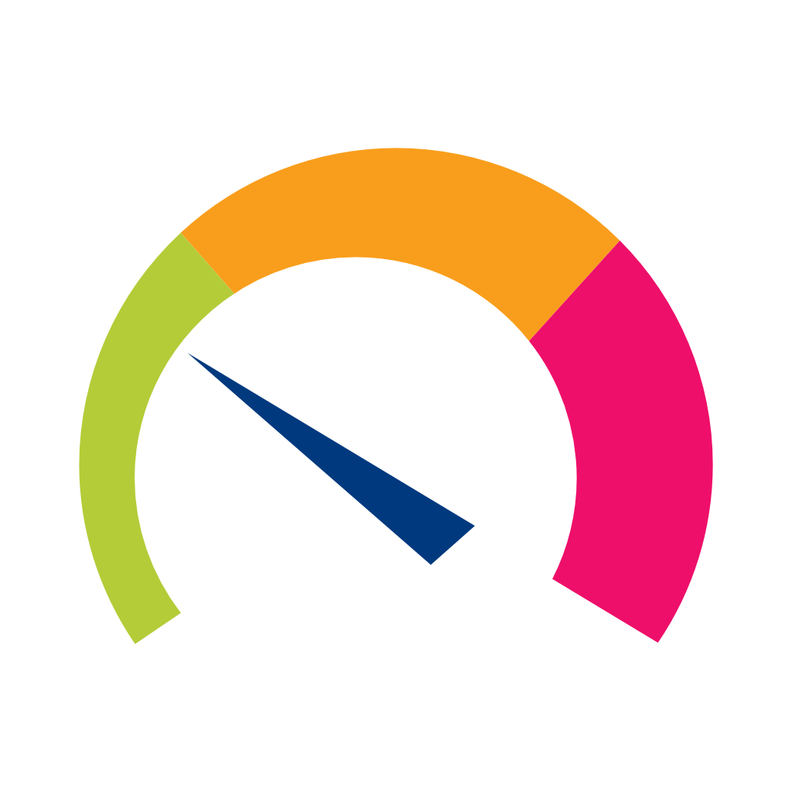
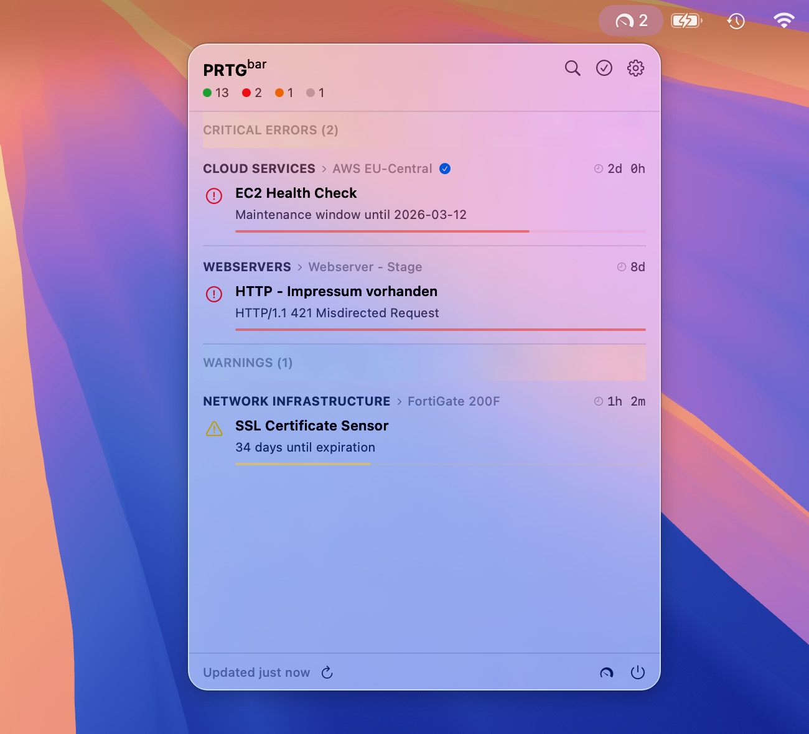

<div align="center">
  

# PRTG<sup>bar</sup>

**PRTG Network Monitor in your macOS menu bar.**

[](https://www.apple.com/macos/)
[](https://swift.org)
[](https://developer.apple.com/xcode/)
[](LICENSE)

</div>

PRTGBar sits in your macOS menu bar and shows all down and warning sensors from your PRTG instance at a glance — grouped by severity, with live badge counts and instant macOS notifications.

<div align="center">
  
</div>

> [!NOTE]
> PRTGBar uses the **PRTG v1 REST API** (`/api/table.json`) with an API token for authentication. PRTG 22+ with API access enabled is required.

---

## ✨ Features

- **Problems view** — all down and warning sensors grouped into Critical Errors and Warnings with sticky headers
- **Alert rows** — breadcrumb path, status icon, sensor name, error message, and duration progress bar
- **Menu bar badge** — live count of down sensors
- **macOS notifications** — configurable alerts on sensor status changes with status-specific icons
- **Search & filter** — find sensors by name, device, or message; hide acknowledged sensors
- **Self-signed SSL** — works with PRTG instances behind private certificates
- **Keychain storage** — API key stored securely in macOS Keychain

---

## 🔥 Installation

### Homebrew (recommended)

```sh
brew install konradmichalik/tap/prtgbar
```

> [!TIP]
> After installing via Homebrew, launch PRTGBar from Spotlight or Applications. On first launch, macOS may ask you to allow the app in **System Settings > Privacy & Security**.

### Upgrade

```sh
brew upgrade prtgbar
```

### Build from source

See [docs/DEVELOPMENT.md](docs/DEVELOPMENT.md).

---

## ⚙️ Setup

Open the settings panel via the gear icon in the PRTGBar toolbar and configure your connection:

| Setting | Description |
|---------|-------------|
| **Server URL** | Your PRTG hostname or IP, e.g. `prtg.example.com`. HTTPS is assumed when no scheme is specified. |
| **API Key** | A PRTG API token. Stored in the macOS Keychain. |
| **Accept self-signed certificates** | Allow connections to PRTG instances with self-signed SSL certificates. Enabled by default. |

> [!WARNING]
> The API key requires sufficient PRTG permissions to read sensors, devices, groups, and probes. A read-only account with global visibility is recommended.

### Generating a PRTG API Token

1. Log in to your PRTG instance.
2. Go to **Setup > My Account > API Keys**.
3. Create a new key with **Read** access.
4. Paste the token into PRTGBar's **API Key** field.

Once saved, PRTGBar polls immediately — no restart required.

---

## 📜 License

MIT — see [LICENSE](LICENSE).
