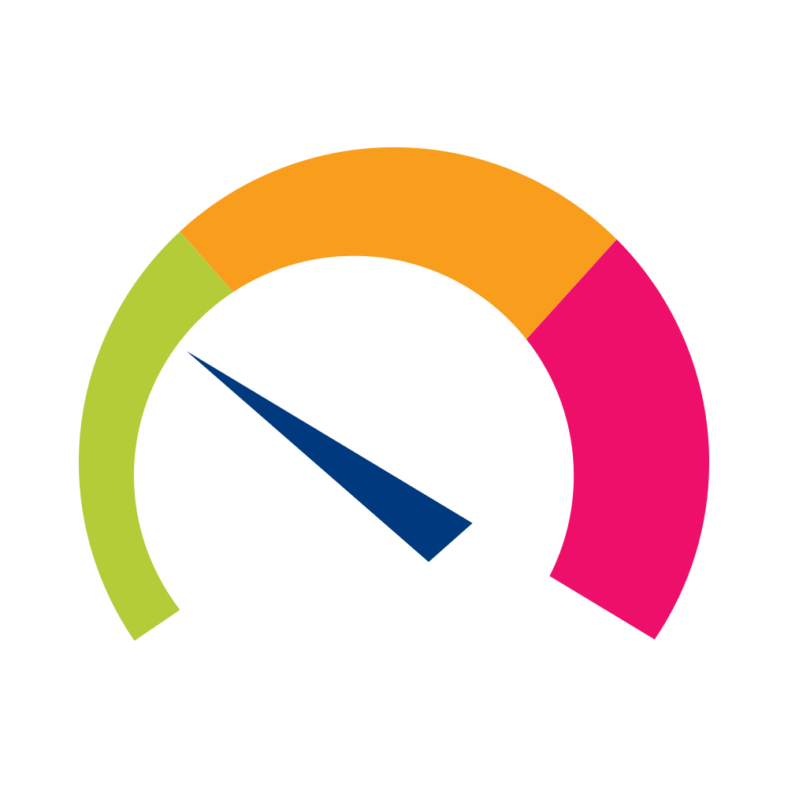

<div align="center">
  

# PRTGBar

**PRTG Network Monitor in your macOS menu bar.**

[](https://www.apple.com/macos/)
[](https://swift.org)
[](https://developer.apple.com/xcode/)
[](LICENSE)

</div>

PRTGBar is a lightweight macOS menu bar agent that connects to a PRTG Network Monitor instance and surfaces sensor health at a glance. The default **Problems view** shows a flat, prioritized list of every down or warning sensor with breadcrumb paths — no drilling through the tree to find what broke. Switch to the **All Sensors tab** to see the full probe → group → device → sensor hierarchy. A badge on the menu bar icon counts down sensors in real time, and macOS notifications fire the moment a sensor transitions to `down`.

> [!NOTE]
> PRTGBar uses the **PRTG v1 REST API** (`/api/table.json`) with an API token for authentication. PRTG 22+ with API access enabled is required.

---

## ✨ Features

- **Problems-first view** — default tab shows a flat list of all down and warning sensors sorted by severity, each with a breadcrumb path (`device › group`)
- **Full sensor tree** — switch to the All Sensors tab for the complete probe → group → device → sensor hierarchy with collapsible DisclosureGroups
- **Menu bar badge** — live count of `down` sensors; disappears when everything is healthy
- **Status summary bar** — color-coded pill counts for up / down / warning / paused sensors
- **macOS notifications** — fires when any sensor transitions to the `down` state
- **Acknowledged sensor indicator** — sensors acknowledged in PRTG display a compact checkmark instead of the verbose acknowledgement text
- **Auto-expand errors** — groups and devices with problems open automatically in the tree view
- **Context menus** — jump directly to any sensor or object in the PRTG web UI with one click
- **Auto-polling on launch** — starts fetching immediately; no manual "Test Connection" needed
- **Self-signed SSL support** — works with internal PRTG instances behind private certificates
- **Keychain storage** — the API key is stored in the system Keychain, never in `UserDefaults`
- **Adaptive icon** — BW template image respects macOS light/dark menu bar appearance
- **No Dock icon** — pure agent app (`LSUIElement = true`), lives only in the menu bar

---

## 🔥 Installation

### Homebrew (recommended)

```sh
brew install konradmichalik/tap/prtgbar
```

> [!TIP]
> After installing via Homebrew, launch PRTGBar from Spotlight or Applications. On first launch, macOS may ask you to allow the app in **System Settings → Privacy & Security**.

### Build from source

See [Getting Started](#-getting-started) below.

---

## 🚀 Getting Started

### Prerequisites

| Tool | Version |
|------|---------|
| macOS | 14.0 (Sonoma) or later |
| Xcode | 16+ |
| XcodeGen | any (`brew install xcodegen`) |

### Build

```sh
# 1. Clone the repo
git clone https://github.com/konradmichalik/prtgbar.git
cd prtgbar

# 2. Generate the Xcode project
make xcode

# 3. Open in Xcode and run, or build a release binary
make build
```

> [!IMPORTANT]
> Never edit `PRTGBar.xcodeproj` directly. All project configuration lives in `project.yml` (XcodeGen spec). Run `make xcode` to regenerate after any changes to that file.

---

## ⚙️ Configuration

Open the settings panel via the gear icon in the PRTGBar popover.

| Setting | Description |
|---------|-------------|
| **Server URL** | Your PRTG hostname or IP, e.g. `prtg.example.com`. HTTP/HTTPS scheme is optional — HTTPS is assumed when omitted. |
| **API Key** | A PRTG API token. Stored in the macOS Keychain, never in `UserDefaults`. |
| **Refresh Interval** | How often PRTGBar polls: 30 s, 1 min, 2 min, or 5 min. |
| **Auto-expand errors** | Automatically expand groups and devices that contain `down` sensors in the All Sensors view. |
| **Notifications** | Receive a macOS notification each time a sensor transitions to `down`. |

> [!WARNING]
> The API key requires sufficient PRTG permissions to read sensors, devices, groups, and probes across the entire object hierarchy. A read-only account with global visibility is recommended.

### Generating a PRTG API Token

1. Log in to your PRTG instance.
2. Go to **Setup → My Account → API Keys**.
3. Create a new key with **Read** access.
4. Paste the token into PRTGBar's **API Key** field.

Once saved, PRTGBar polls immediately — no restart or manual test required.

---

## 💡 Usage

After configuring a server URL and API key, PRTGBar starts polling automatically and opens to the **Problems** tab:

```
Problems                          All Sensors

  2 Down                          [probe]  Core Network
  ✕  Interface Eth0               [group]  Datacenter A
     router-01 › Datacenter A       [device]  router-01
  ✕  Disk C:                          ● Ping            up
     fileserver › Datacenter B        ● CPU Load        warning
                                    [device]  switch-01
  1 Warning                              ✕ Interface Eth0  down
  ⚠  CPU Load       ✓  [ack msg]
     router-01 › Datacenter A
```

Acknowledged sensors show a small green checkmark in place of the full "Acknowledged by user [date]: ..." prefix.

**Context menus** on any row offer:
- **Open in PRTG** — opens the object's detail page in your browser
- **Copy Name / ID** — copies the object name or numeric PRTG ID to the clipboard

---

## 🧑‍💻 Contributing

Contributions are welcome. The project uses XcodeGen so there are no `.xcodeproj` merge conflicts.

```sh
# Run unit tests
xcodebuild test -scheme PRTGBar -destination 'platform=macOS'

# Clean all build artifacts and the generated project
make clean
```

**Project layout**

```
PRTGBar/
├── PRTGBarApp.swift          Entry point, MenuBarExtra scene
├── Models/
│   ├── AppState.swift        @MainActor observable, polling, notifications
│   └── PrtgData.swift        DTOs, TreeNode, TreeBuilder, ProblemItem
├── Services/
│   ├── PrtgClient.swift      Async v1 API client, SSL delegate
│   └── KeychainService.swift Thin Security framework wrapper
└── Views/
    ├── MenubarView.swift      Popover: header, status pills, tab switcher, footer
    ├── ProblemsView.swift     Flat problem list with breadcrumbs (default tab)
    ├── ObjectSection.swift    Recursive DisclosureGroup per object kind
    └── SettingsView.swift     Server URL, API key, interval, toggles
```

> [!NOTE]
> PRTGBar targets Swift 6 strict concurrency. All API calls run in detached tasks; UI mutations are dispatched back to `@MainActor`.

---

## 📜 License

MIT — see [LICENSE](LICENSE).
